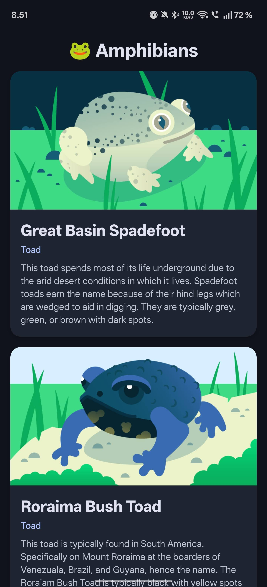

# Android Apps

A collection of Android applications built with Kotlin and Jetpack Compose for learning and practice.

## Projects

### 📚 Bookshelf

A book discovery app that fetches books from the Google Books API and displays them in a grid layout with images, titles, and authors.

**Features:**

- Fetch books from Google Books API
- Grid layout with book covers
- Material Design 3 UI
- Error handling and loading states

**Tech Stack:** Kotlin, Jetpack Compose, Retrofit, Coil, Material3

### 🐸 Amphibians

An educational app showcasing various amphibian species with detailed information and images, fetched from an API.

**Features:**

- Fetch list of amphibian species from API
- Detailed descriptions and classifications
- Responsive card-based layout
- Smooth scrolling experience

**Tech Stack:** Kotlin, Jetpack Compose, Retrofit, Coil, Material3

## Development

Both apps follow modern Android development practices:

- **Architecture:** MVVM with Repository pattern
- **UI:** Jetpack Compose with Material Design 3
- **Networking:** Retrofit with Kotlin Serialization
- **Image Loading:** Coil
- **Dependency Injection:** Manual DI with containers
